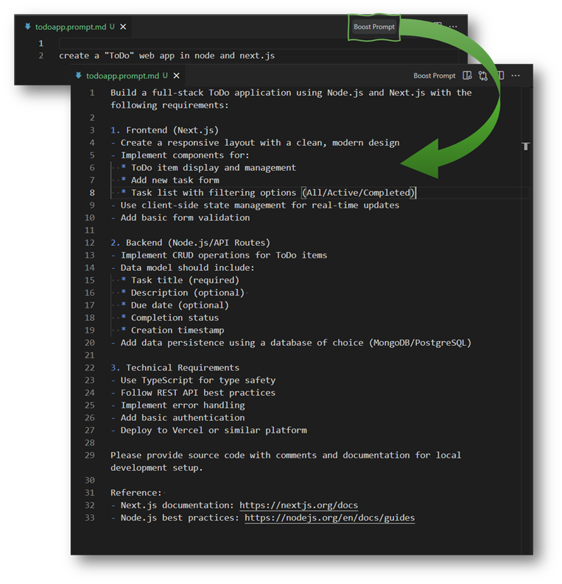
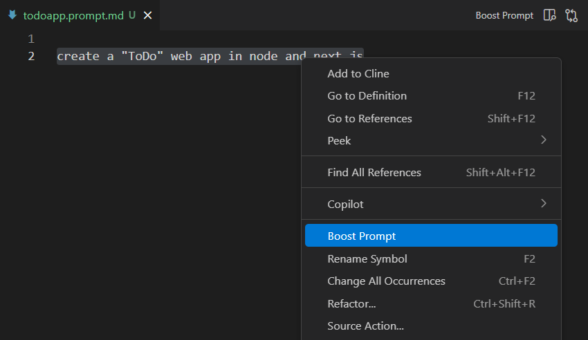
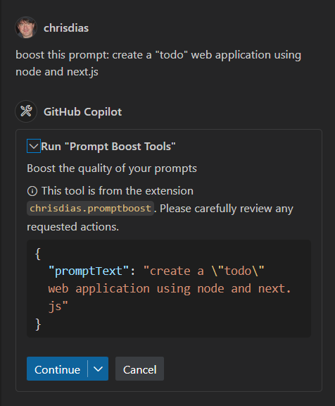

# Prompt Boost

Transform simple prompts into powerful, context-rich instructions that help GitHub Copilot understand exactly what you need. This extension enhances your prompts by adding relevant technical context, best practices, and specific requirements that lead to better, more accurate responses.


[Image placeholder: Screenshot showing a simple prompt being transformed into a detailed one]

## Why Prompt Boost?

- 🚀 Turn basic prompts into comprehensive instructions
- 💡 Get more accurate and relevant responses from GitHub Copilot
- ⏱️ Save time by automating prompt enhancement
- 🎯 Improve consistency in AI-generated code

## Using Prompt Boost

### Method 1: Using .prompt.md Files

1. Create or open a `.prompt.md` file
2. Write your basic prompt
3. Either:
   - Right-click and select "Boost Prompt"
   - Use the editor menu and select "Boost Prompt"


[Image placeholder: Screenshot showing the context menu with Boost Prompt option]

### Method 2: VS Code Chat

1. Open VS Code Chat
2. Select Agent mode
3. Write your prompt and ask Copilot to "boost" it
4. Use the enhanced prompt for better results


[Image placeholder: Screenshot showing Prompt Boost being used in VS Code Chat]

## Examples

Basic prompt:
```
Create a REST API for a todo app
```

Enhanced prompt:
```
Create a REST API for a todo app with the following specifications:
- Use Node.js with Express framework
- Implement CRUD operations for todo items
- Include input validation
- Follow RESTful best practices
- Add error handling
- Include API documentation
- Use async/await for database operations
- Implement proper status codes
```

## Development

### Prerequisites
- Node.js (v20 or later) and npm (v9 or later) https://nodejs.org/

Check your Node versions:

```bash
node -v
npm -v
```

### Get the Source

``` bash
git clone https://github.com/chrisdias/vscode-prompt-boost.git
cd vscode-prompt-boost
```

### Install dependencies, open VS Code, and run the extension

```bash
npm install && code-insiders . -r
```

Once in VS Code open the Debug View (`Ctrl+Shift+D`) and select the `Run Extension` target.

The extension will build and then a new instance of VS Code will open with the extension loaded. You can use this instance to test this extension.

Open the Chat View, choose the Agent mode, and write your prompt, asking Copilot to "boost" its power

_"I want to create a new "ToDo" web app in node. First, boost this prompt with the prompt boost tool and then write the code for the app"_

### API Documentation

- https://code.visualstudio.com/api/extension-guides/chat
- https://code.visualstudio.com/api/extension-guides/language-model

